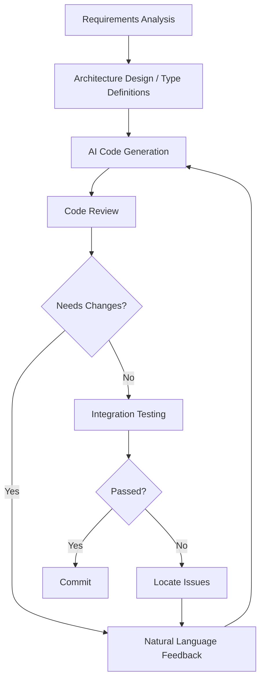

## Introduction: The Birth of a New Programming Paradigm

In early 2025, Andrej Karpathy — former co-founder of OpenAI and former head of AI at Tesla — introduced a thought-provoking concept: **Vibe Coding**. He described this new era of programming as follows:

> "It's a new kind of programming where you fully give in to the vibes, you describe what you want, and let the AI implement it. You just kind of vibe out, occasionally glance at the generated code, click 'Accept', and most of the time you don't even need to know exactly how the code was written."

This definition struck a chord with countless developers. We are standing at an inflection point: **the core activity of programming is shifting from 'writing code' to 'describing requirements'**. This isn't an incremental improvement at the tool level — it's a fundamental change in the development paradigm.

## What is Vibe Coding

### Origin of the Concept

Vibe Coding didn't emerge from nowhere. It is the inevitable outcome of converging technology trends:

| Trend | Key Breakthrough | Impact on Programming |
| --- | --- | --- |
| Large Language Models | GPT-4, Claude 3.5/4, DeepSeek reached practical thresholds | Code generation quality reached acceptable levels |
| Code Completion Evolution | Cursor, GitHub Copilot, Tabnine | From single-line to multi-line/function-level generation |
| Deep IDE Integration | Cursor, Windsurf, CodeBuddy | AI understands entire project context |
| Multimodal Capabilities | Claude 3.5 Vision, GPT-4o | Screenshots directly generate UI code |
| Autonomous Programming Agents | Devin and similar projects | AI completes full flow from requirements to deployment |

### Core Definition

Vibe Coding can be understood as **a development paradigm where natural language becomes the primary programming language**. In traditional coding, developers speak to computers in programming languages; in Vibe Coding, developers describe goals to AI in natural language, and AI translates those goals into executable code.

This doesn't mean "no coding at all" — it means **shifting focus from 'how to implement' to 'what to implement'**. Developers no longer need to interrupt their train of thought for every syntax detail, API call pattern, or edge case handling. Instead, they express intent in natural language and let AI handle the implementation details.

### Key Differences from Traditional Development

| Dimension | Traditional Development | Vibe Coding |
| --- | --- | --- |
| Core Activity | Writing code | Describing requirements, reviewing code |
| Thinking Model | Implementation thinking (How) | Design thinking (What) |
| Bottleneck | Coding speed | Clarity of requirements, review ability |
| Error Sources | Syntax errors, logic gaps | Requirement misunderstandings, AI hallucinations |
| Learning Curve | Language syntax, framework APIs | Prompt engineering, code review |
| Iteration Speed | Slow (manual edits) | Fast (natural language instructions) |
| Entry Barrier | High (must master language) | Low (must master domain knowledge) |

## Three Core Principles of Vibe Coding

### 1. Natural Language First

Natural language becomes the "first language" of the development process:

- **Requirement description > Interface design**: Instead of writing API docs first and coding second, directly describe functional behavior
- **Intent-driven > Implementation-driven**: Tell AI "redirect users to their last viewed page after login" rather than "read localStorage in mounted, call router.push"
- **Iterative refinement > One-shot perfection**: Let AI generate an initial version, then refine it through natural language feedback

### 2. Context Is Everything

In Vibe Coding, the depth of AI's project understanding determines code quality. Effective context management includes:

- **README and architecture docs**: Help AI understand overall project design
- **Codebase indexing**: Tools like Cursor and Copilot index the entire codebase for precise completions
- **Type system**: Well-defined TypeScript types are themselves the best context for AI
- **Design specs and Design Tokens**: Ensure AI-generated code follows project conventions

```typescript
// Example: Providing context through type definitions
// Once AI sees this type definition, generated components naturally follow the interface
export interface BlogPost {
  title: string
  description?: string
  date: string
  tags: string[]
  category?: string
  draft: boolean
  path: string
}
```

### 3. Review Is Programming

In Vibe Coding, **reviewing code is more important than writing it**. Developers need to cultivate new core skills:

- **Quickly understanding AI-generated code**: Judging whether the logic is correct and if there are security risks
- **Precisely pointing out issues**: "The condition on line 3 missed a null check" is far more effective than "this code has problems"
- **Boundary awareness**: Proactively thinking about edge cases AI might miss (null values, extremely long inputs, race conditions, etc.)
- **Security review**: AI can introduce SQL injection, XSS, and other security vulnerabilities — vigilance is required

## Practical Implementation: From Theory to Action

### Step 1: Toolchain Setup

Building an efficient Vibe Coding workflow requires choosing the right tool combination:

```bash
# Recommended frontend Vibe Coding toolchain
- Cursor / Windsurf        # AI-first IDE with deep project context understanding
- GitHub Copilot           # Code completion, line to function level
- Claude (Projects)        # Complex architecture design, code review
- CodeBuddy (AGENTS.md)    # Project-level AI context, guiding AI understanding
```

**Key configuration**: Maintain an AGENTS.md (or CLAUDE.md) in the project root, describing the project's architectural constraints, coding conventions, and Design Token information. This serves as a project manual for AI, significantly improving generation accuracy.

### Step 2: Prompt Engineering in Practice

Effective prompting is the core skill of Vibe Coding. Here are several proven techniques:

**Technique 1: Provide Specific Constraints**

```
❌ Inefficient: "Create a blog list component for me"
✅ Effective: "Create a blog article list component with a responsive grid layout
   (1 column on mobile/2 on tablet/3 on desktop). Each card includes a cover image
   (lazy loaded), tags (max 3), title, description (line-clamp-2), and publish date.
   The entire card is clickable with hover lift and shadow enhancement effects.
   Use Design Tokens instead of hardcoded colors."
```

**Technique 2: Step-by-Step Progression**

```
# Step 1: Define types first
Please define TypeScript interfaces for the following scenario:...

# Step 2: Generate components based on types
Based on the type definitions above, create a component that implements...

# Step 3: Add interaction effects
Add hover animations and click feedback to the component...
```

**Technique 3: Provide Negative Examples**

```
Please create a search component. Important notes:
- Do NOT use debounce time under 300ms (characters will be dropped during input)
- Do NOT send a request on every keystroke (must debounce)
- The search results list must support keyboard up/down navigation
```

### Step 3: Workflow Design

An efficient Vibe Coding workflow should include these stages:



**Key difference**: In traditional development, debugging takes up significant time; in Vibe Coding, the review-and-feedback cycle becomes the primary activity.

## When to Use Vibe Coding (and When Not To)

Vibe Coding is not a silver bullet. Here are proven scenario classifications:

| Scenario | Vibe Coding Effectiveness | Notes |
| --- | --- | --- |
| Standard CRUD pages | ⭐⭐⭐⭐⭐ | Tables, forms, lists — template-heavy pages |
| UI Component Development | ⭐⭐⭐⭐ | Excellent with Design Tokens and component libraries |
| API Integration | ⭐⭐⭐⭐⭐ | Generate calling code from API documentation |
| Unit Tests | ⭐⭐⭐⭐⭐ | High coverage, fast generation |
| Regular Expressions | ⭐⭐⭐⭐⭐ | Let AI handle the pain of writing regex |
| Complex Algorithms | ⭐⭐⭐ | Requires clear algorithm descriptions and expected outputs |
| Performance Optimization | ⭐⭐ | AI struggles to understand runtime performance bottlenecks |
| Security-Critical Code | ⭐ | Authentication, authorization — business-critical scenarios need caution |
| Legacy System Maintenance | ⭐⭐ | Unfamiliar codebases with limited AI context |
| Architecture Design | ⭐⭐⭐ | Useful as an assistant, but final decisions require human judgment |

## Challenges and Reflections

### 1. Quality Control

AI-generated code may look "correct" but have deep logical flaws. Here's our proven review checklist:

- [ ] Are edge cases handled? (null values, abnormal inputs, overflow)
- [ ] Are async operations properly error-caught?
- [ ] Any memory leak risks? (unbound event listeners, uncleared timers)
- [ ] Are types correct? (avoid implicit any)
- [ ] Any security vulnerabilities? (XSS, SQL injection, sensitive data leaks)
- [ ] Is performance acceptable? (large data rendering, high-frequency operations)
- [ ] Does it follow existing project coding conventions?

### 2. Maintainability

AI-generated code tends to favor "write it once and done" over "easy to maintain later". Common issues include:

- **Over-abstraction**: AI loves extracting reusable functions, but often detached from actual reuse scenarios
- **Non-semantic naming**: Generic names like `processData`, `handleClick` are frequent
- **Missing comments**: AI considers clear code comment-free, but complex logic still needs them
- **Inconsistent style**: Code generated in different sessions may have inconsistent styles

**Solution**: Clearly define coding conventions in AGENTS.md, or emphasize "follow the project's code style" in prompts.

### 3. Skill Degradation Risk

This is the risk that demands the most vigilance. When AI takes over coding work, which developer skills might degrade?

| Skills at Risk | How to Maintain |
| --- | --- |
| Understanding of underlying principles | Regularly read AI-generated code, understand its implementation logic |
| Debugging and troubleshooting skills | AI handles simple bugs, complex problems remain the developer's responsibility |
| Code aesthetics and quality awareness | Never blindly accept AI-generated code without review |
| Deep understanding of new technologies | Use AI as a learning assistant, but practice core concepts yourself |

### 4. Team Collaboration Changes

Vibe Coding transforms team collaboration patterns:

- **Code Review becomes doubly important**: AI-generated code also needs review — potentially more carefully
- **Knowledge retention challenge**: When code is mostly AI-generated, how do newcomers understand design decisions?
- **Communication pattern shift**: Teams need to establish shared mechanisms for Prompt best practices

## Future Outlook

### The Evolution of the Developer Role

We can anticipate the trajectory of developer role transformation:

```
Traditional Developer → AI-Assisted Developer → AI-Collaborative Developer → AI Guide
                                                                                 ↓
                                                                       Focus on:
                                                                       Architecture Design
                                                                       Requirements Analysis
                                                                       Quality Control
                                                                       Innovation
```

In the foreseeable future, **pure coding ability will no longer be a developer's core competitive advantage**. It will be replaced by:

1. **Requirement Decomposition**: Breaking complex business requirements into AI-executable steps
2. **System Design**: Overall architecture design and key technical decisions
3. **Quality Control**: Review, testing, security assessment
4. **AI Collaboration**: Prompt engineering, context management, Agent orchestration

### Opportunities for Frontend Developers

For frontend developers, Vibe Coding brings more opportunities than challenges:

- **Lowered barriers, broadened horizons**: Full-stack development, once requiring backend knowledge, is now accessible
- **Faster prototyping**: Time from idea to demonstrable prototype is dramatically reduced
- **Creativity unleashed**: Freed from implementation details to focus on user experience and interaction design
- **Quantum leap in efficiency**: As I've seen in my own work after introducing AI workflows, a 45% improvement in new feature development efficiency is not an exaggeration

## Conclusion

Vibe Coding is not about replacing developers — it's about **redefining how developers work**. Just as the Industrial Revolution didn't render humans useless but instead liberated them from repetitive labor for more creative work, Vibe Coding is undergoing a similar paradigm shift.

The key is: **embrace change, but stay clear-headed**. Fully leverage the efficiency gains AI brings, while never abandoning the pursuit of code quality, system design, and engineering principles. The best developers are neither those who completely rely on AI nor those who reject it — they are those who **know when to let AI take over and when to step in themselves**.

> The future of programming isn't about not writing code — it's about writing less code that matters more.
