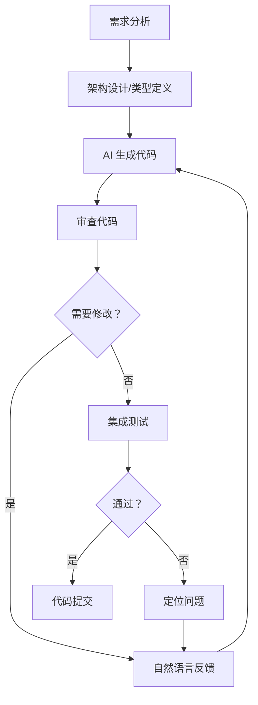

## 引言：一个新编程范式的诞生

2025 年初，前 OpenAI 联合创始人、特斯拉 AI 负责人 Andrej Karpathy 提出了一个引人深思的概念——**Vibe Coding（氛围编程）**。他这样描述这个新时代的编程方式：

> "这是一种全新的编程模式，你不再逐行编写代码，而是描述你想要什么，让 AI 去实现它。你完全沉浸在这种'氛围'中，偶尔瞥一眼生成的代码，点击'接受'，大多数时候你甚至不需要知道代码具体是怎么写的。"

这个定义击中了无数开发者的共鸣。我们正站在一个转折点上：**编程的核心活动正在从"写代码"转变为"描述需求"**。这不是工具层面的渐进式改进，而是开发范式的根本性变化。

## 什么是氛围编程

### 概念溯源

氛围编程并非凭空出现。它是以下技术趋势交汇的必然产物：

| 趋势 | 关键突破 | 对编程的影响 |
| --- | --- | --- |
| 大语言模型 | GPT-4、Claude 3.5/4、DeepSeek 等达到实用阈值 | 代码生成质量达到可接受水平 |
| 代码补全进化 | Cursor、GitHub Copilot、Tabnine | 从单行补全到多行/函数级生成 |
| IDE 深度集成 | Cursor、Windsurf、CodeBuddy | AI 理解整个项目上下文 |
| 多模态能力 | Claude 3.5 视觉、GPT-4o | 截图直接生成 UI 代码 |
| Agent 自主编程 | Devin、Devin 类项目 | AI 自主完成从需求到部署的全流程 |

### 核心定义

氛围编程可以理解为**以自然语言为主要编程语言的开发范式**。在传统编程中，开发者用编程语言与计算机对话；在氛围编程中，开发者用自然语言对 AI 描述目标，AI 负责将其转换为可执行的代码。

这不是"不用写代码"，而是**将关注的焦点从"如何实现"转移到"实现什么"**。开发者不再需要为每个语法细节、API 调用方式、边界条件处理而打断思路，而是用自然语言表达意图，让 AI 处理实现层的细节。

### 与传统开发的核心差异

| 维度 | 传统开发 | 氛围编程 |
| --- | --- | --- |
| 核心活动 | 编写代码 | 描述需求、审查代码 |
| 思维模式 | 实现思维（How） | 设计思维（What） |
| 瓶颈 | 编码速度 | 需求清晰度和审查能力 |
| 错误来源 | 语法错误、逻辑遗漏 | 需求误解、AI 幻觉 |
| 学习曲线 | 语言语法、框架 API | Prompt 工程、代码审查 |
| 迭代速度 | 慢（手动修改） | 快（自然语言修改指令） |
| 入门门槛 | 高（需掌握语言） | 低（需掌握领域知识） |

## 氛围编程的三大核心原则

### 1. 自然语言优先

自然语言成为开发过程中的"第一语言"。这意味着：

- **需求描述 > 接口设计**：不再先写接口文档再编码，而是直接描述功能行为
- **意图驱动 > 实现驱动**：告诉 AI "用户登录后跳转到上次浏览的位置"，而非"在 mounted 中读取 localStorage，调用 router.push"
- **迭代修正 > 一次性完美**：先让 AI 生成初步版本，然后通过自然语言反馈逐步完善

### 2. 上下文即一切

氛围编程中，AI 对项目的理解深度决定了生成代码的质量。良好的上下文管理包括：

- **项目 README 和架构文档**：让 AI 了解项目整体设计
- **代码库索引**：Cursor、Copilot 等工具通过索引整个代码库提供精准补全
- **类型系统**：完善的 TypeScript 类型定义本身就是给 AI 的最佳上下文
- **设计规范和 Design Token**：让 AI 生成的代码符合项目风格

```typescript
// 示例：通过类型定义给 AI 提供上下文
// 当 AI 看到这个类型定义后，生成的组件会自然遵循接口规范
export interface BlogPost {
  title: string
  description?: string
  date: string
  tags: string[]
  category?: string
  draft: boolean
  path: string
}
```

### 3. 审查即编程

在氛围编程中，**审查代码比编写代码更重要**。开发者需要培养新的核心能力：

- **快速理解 AI 生成代码的能力**：判断逻辑是否正确、是否有安全风险
- **精准指出问题的能力**："第三行的条件判断遗漏了空值检查"比"这段代码有问题"有效得多
- **边界意识**：主动思考 AI 可能遗漏的边界情况（空值、超长文本、并发竞态等）
- **安全审查**：AI 可能引入 SQL 注入、XSS 等安全漏洞，必须保持警惕

## 落地实践：从理念到行动

### 第一步：工具链搭建

构建高效的氛围编程工作流，需要选择合适的工具组合：

```bash
# 推荐的前端氛围编程工具链
- Cursor / Windsurf    # AI-first IDE，深度理解项目上下文
- GitHub Copilot       # 代码补全，行级到函数级
- Claude (Projects)    # 复杂架构设计、代码审查
- CodeBuddy (AGENTS.md) # 项目级 AI 上下文，指导 AI 理解项目架构
```

**关键配置**：在项目根目录维护一份 AGENTS.md（或 CLAUDE.md），描述项目的架构约束、编码规范、Design Token 信息。这相当于给 AI 一份项目说明书，大幅提升生成代码的准确率。

### 第二步：Prompt 工程实战

高效的 Prompt 是氛围编程的核心技能。以下是几个经过验证的技巧：

**技巧一：给出具体约束**

```
❌ 低效："帮我写一个博客列表组件"
✅ 高效："创建一个博客文章列表组件，使用响应式网格布局（手机1列/平板2列/桌面3列），
  卡片包含封面图（懒加载）、标签（最多显示3个）、标题、摘要（line-clamp-2）、发布日期。
  整张卡片可点击，hover 时有上浮和阴影增强效果。使用 Design Token 而非硬编码颜色。"
```

**技巧二：分步递进**

```
# 第一步：先定义类型
请帮我为以下场景定义 TypeScript 接口：...

# 第二步：根据类型生成组件
基于上面的类型定义，创建组件实现...

# 第三步：添加交互效果
在组件上添加 hover 动画和点击反馈...
```

**技巧三：提供反例**

```
请生成一个搜索组件，注意：
- 不要使用防抖时间低于 300ms（用户输入过程中会丢失字符）
- 不要在每次输入时都发起请求（必须防抖）
- 搜索结果列表要支持键盘上下键导航
```

### 第三步：工作流设计

一个高效的氛围编程工作流应该包含以下阶段：



**关键差异**：传统开发中，调试阶段占据大量时间；氛围编程中，审查和反馈循环成为主要活动。

## 适用边界：什么时候用，什么时候不用

氛围编程并非万能灵药。以下是经过实践验证的场景划分：

| 场景 | 氛围编程效果 | 说明 |
| --- | --- | --- |
| 标准化 CRUD 页面 | ⭐⭐⭐⭐⭐ | 表格、表单、列表等模板化页面 |
| UI 组件开发 | ⭐⭐⭐⭐ | 配合 Design Token 和组件库效果极佳 |
| API 对接 | ⭐⭐⭐⭐⭐ | 根据接口文档生成调用代码 |
| 单元测试 | ⭐⭐⭐⭐⭐ | 覆盖率高，生成速度快 |
| 正则表达式 | ⭐⭐⭐⭐⭐ | 人类写正则的痛苦交给 AI |
| 复杂算法 | ⭐⭐⭐ | 需要明确的算法描述和期望输出 |
| 性能优化 | ⭐⭐ | AI 难以理解实际运行时的性能瓶颈 |
| 安全问题 | ⭐ | 认证、权限等涉及业务安全的场景需谨慎 |
| 遗留系统维护 | ⭐⭐ | 不熟悉的旧代码库，AI 上下文有限 |
| 架构设计 | ⭐⭐⭐ | 可作为辅助工具，但最终决策需要人工 |

## 挑战与反思

### 1. 质量把控

AI 生成的代码看起来"正确"，但可能在深层逻辑上存在缺陷。以下是我们实践中总结的审查清单：

- [ ] 边界条件是否处理（空值、异常值、超长输入）
- [ ] 异步操作是否有错误捕获
- [ ] 是否有内存泄漏风险（事件监听未解绑、定时器未清理）
- [ ] 类型是否正确（避免隐式 any）
- [ ] 是否有安全漏洞（XSS、SQL 注入、敏感信息泄露）
- [ ] 性能是否可接受（大量数据渲染、高频操作）
- [ ] 是否遵循项目现有编码规范

### 2. 可维护性

AI 生成的代码往往倾向于"一次性写好"，而不是"方便后续维护"。常见问题包括：

- **过度抽象**：AI 喜欢提取大量可复用函数，但往往脱离实际的复用场景
- **命名不够语义化**：`processData`、`handleClick` 等通用命名频发
- **缺少注释**：AI 认为清晰的代码不需要注释，但复杂逻辑仍然需要
- **不一致的风格**：每个 session 生成的代码风格可能不一致

**解决方案**：在 AGENTS.md 中明确编码规范，或者在 Prompt 中强调"遵循项目的代码风格"。

### 3. 开发者技能退化

这是最需要警惕的风险。当 AI 承担了编码工作后，开发者的哪些能力可能退化？

| 可能退化的能力 | 如何保持 |
| --- | --- |
| 对底层原理的理解 | 定期阅读 AI 生成的代码，理解其实现原理 |
| 调试排错能力 | AI 解决简单 bug，复杂问题仍然是开发者的责任 |
| 代码审美和质量意识 | 坚持审查 AI 生成的代码，不盲目接受 |
| 对新技术的深度理解 | 用 AI 辅助学习，但亲自实践核心概念 |

### 4. 团队协作的变化

氛围编程改变了团队协作的模式：

- **Code Review 的重要性倍增**：AI 生成的代码同样需要 Review，而且可能需要更仔细
- **知识沉淀的挑战**：当代码主要由 AI 生成，新人如何理解系统的设计决策？
- **沟通方式的变化**：团队内部需要建立 Prompt 最佳实践的共享机制

## 未来展望

### 开发者角色的演变

我们可以预见开发者角色的转变轨迹：

```
传统开发者 → AI 辅助开发者 → AI 协作开发者 → AI 指导者
                                                   ↓
                                            专注：架构设计
                                            需求分析
                                            质量把控
                                            创新突破
```

在可预见的未来，**纯编码能力将不再是开发者的核心竞争力**。取而代之的是：

1. **需求分解能力**：将复杂业务需求拆解为 AI 可执行的步骤
2. **系统设计能力**：整体架构设计和关键技术决策
3. **质量把控能力**：审查、测试、安全评估
4. **AI 协作能力**：Prompt 工程、上下文管理、Agent 编排

### 前端开发者的机遇

对于前端开发者而言，氛围编程带来的机遇大于挑战：

- **门槛降低，边界拓宽**：过去需要后端知识的全栈开发变得可行
- **原型验证更快**：从想法到可演示原型的时间大幅缩短
- **创造力释放**：不再被实现细节束缚，可以更专注于用户体验和交互设计
- **效率质变**：正如我在实际工作中引入 AI 工作流后看到的，新需求开发效率提升 45% 并非夸张

## 结语

氛围编程不是要取代开发者，而是**重新定义开发者的工作方式**。正如工业革命没有让人类变得无用，而是让人类从重复劳动中解放出来，从事更有创造性的工作，氛围编程也在经历着类似的范式转变。

关键在于：**拥抱变化，但保持清醒**。充分利用 AI 带来的效率提升，同时不放弃对代码质量、系统设计和工程原则的追求。最好的开发者不是那些完全依赖 AI 的人，也不是那些拒绝 AI 的人，而是那些**懂得何时让 AI 代劳、何时亲自下场的人**。

> 编程的未来不是不用写代码，而是写更少、更有价值的代码。
